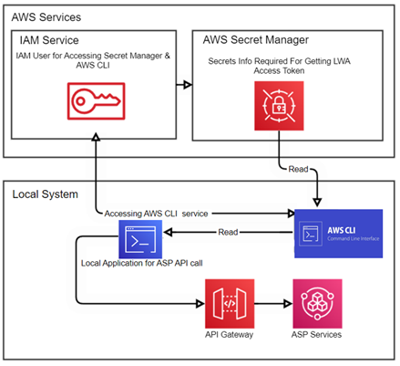

# Using AWS Secrets Manager for LWA Access with the CLI

This guide is designed to help you seamlessly set up an AWS environment to securely store LWA secrets (e.g., client id, client secret, refresh token) and automatically retrieve an LWA access token. This is essential for developers working with Alexa Smart Properties APIs. When using the ASP CLI, the AWS Secrets Manager method is superior to a local store for LWA secrets both from practical and security perspectives. 

We'll walk you through each step, from creating an AWS account to configuring the AWS Secrets Manager and retrieving Access token. The solution architecture is straightforward, involving AWS Secrets Manager to securely handle credentials and tokens. A local CLI application will define functions to refresh LWA access tokens, which are then used for API calls.

## 1. Creating an AWS Account
Before you can start using AWS services, you need an AWS account. Here's how to create one:
1. **Visit the AWS Home Page**: Go to AWS Home and click on the "Create an AWS Account" button.
2. **Begin the Sign-Up Process**: Follow the on-screen instructions. You'll need to provide some basic information and payment details.

## 2. Configuring the AWS Secrets Manager with your secrets
AWS Secrets Manager helps you protect access to your applications, services, and IT resources without the upfront investment and on-going maintenance costs of operating your own infrastructure.

**Step 1: Secret Manager – Setting up Secrets**
1.	Log into your AWS account and search for AWS Secrets Manager. 
2.	Create one secret in AWS Secrets Manager (the secret name can truly be whatever you choose it to be – we will use `lwa-oauth` in this documentation)

**Step 2:  LWA OAuth Secret Setup (the information in this secret is meant to facilitate LWA OAuth)**
1.	Navigate to AWS Secrets Manager in the AWS Console
2.	Click "Store a new secret"
3.	Choose "Other type of secrets" for secret type
4.	Enter necessary key/value pairs for your LWA OAuth credentials

    | Key | Value | Note |
    | --- | --- | --- |
    | lwa-client-id | Add your LWA Client ID | The same LWA Client ID you used in your Postman to get refresh token |
    | lwa-client-secret | Add your LWA Client Secret | The same LWA Client Secret you used in your Postman to get refresh token |
    | lwa-auth-url | https://api.amazon.com/auth/O2/token | |
    | lwa-auth-scope | alexa::enterprise:management profile | The scope value can be vary. It depends on the scope of ASP API you are calling. Please make sure it is the same scope value as you use in your Postman to get refresh token |
    | lwa-refresh-token | Add your inital refresh token | You can retrieve your initial refresh token using various tools including POSTman |

    
5. Click Next
6. Add your Secret Name: We use `lwa-oauth` in this documentation
7. Add Description (optional)
8. Click Next and Create Secret

## 3. Setting Up AWS Credentials with an IAM User
Once your AWS account is ready, you'll need to set up credentials to interact with AWS services programmatically.

**Step 1: Create an IAM User**
- Go to the **IAM dashboard** in the AWS Management Console.
- Click on "Users" in the left navigation pane, then "Add user".
- Enter a username and select "Programmatic access" for AWS access type.
- Click "Next: Permissions" to proceed.

**Step 2: Set Permissions for this IAM User**
- Choose "Attach existing policies directly" and search for `SecretsManagerReadWrite`.
- Select the policy and apply. 

**Step 3: Review and Complete User Creation**
- Review the user details. If everything looks good, click "Create user".
- **Important**: Save the access key ID and secret access key presented to you. They are crucial for the next steps.

## 4. Installing and Configuring AWS CLI
On the computer or server that you use to run the ASP CLI, you will use the AWS CLI to configure access to ASP APIs. The AWS Command Line Interface (CLI) is a unified tool to manage your AWS services.

**Step 1: Install AWS CLI**
- Download and install the AWS CLI from [https://aws.amazon.com/cli/](https://aws.amazon.com/cli/).
- Follow the installation instructions for your operating system.

**Step 2: Configure AWS CLI**
- Open a terminal or command prompt.
- Run the command `aws configure`.
- When prompted, enter your AWS IAM parameters: access key ID, secret access key, preferred AWS region, and output format (typically JSON).

## 5. Configuring the ASP CLI to use AWS Secrets Manager
1.	In the ASP CLI repository, navigate to the asp-cli folder
2.	Edit the file `config/default.json`
3.  In the node `asp_cli` node, set `"auth": "secretsManager"`
4.  In the node `secretsManager`, set `"secretNameForOAuth": "lwa-oauth"` (or your AWS Secret Manager secret's name if you chose a different name)
5.  in the node `secretsManager`, set `"regionName": "us-east-1"` (or you AES Secret Manager's region if it is different)
